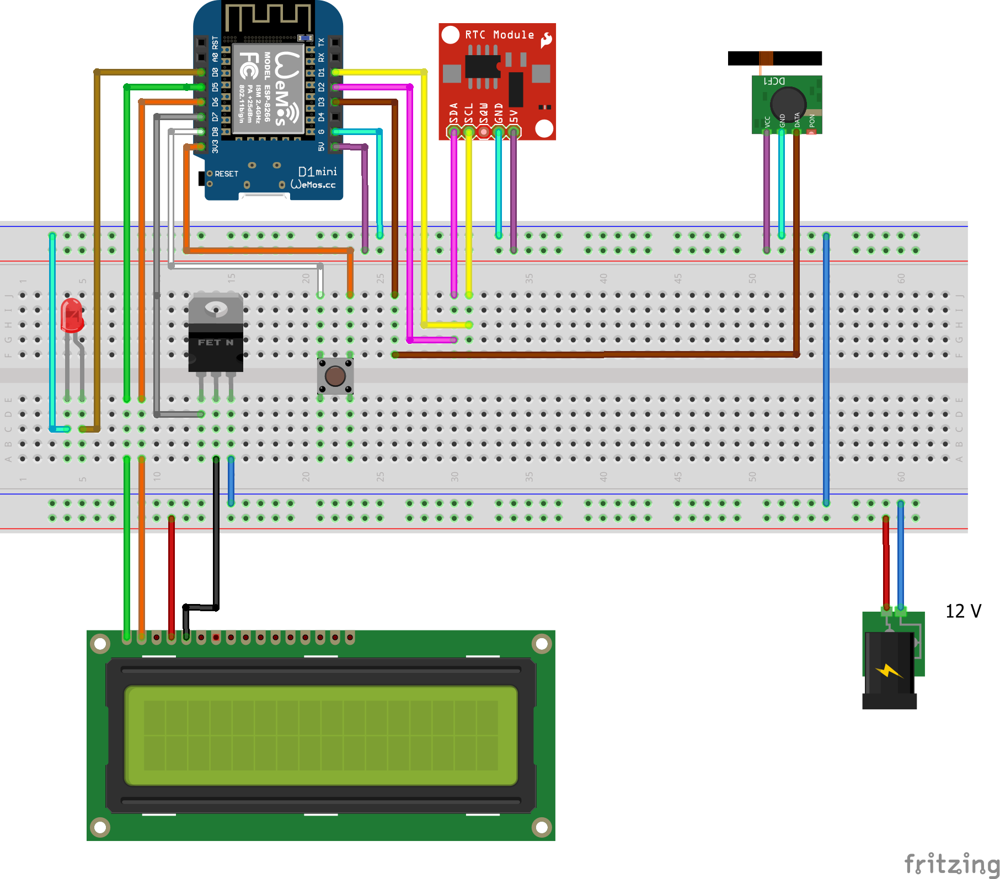

# NixdorfVfdClock
Building a desktop clock using a Nixdorf BA63 customer display

## Instructions

## Additional hints

## Parts
- D1 mini (esp8266)
- RTC shield for D1 mini (e.g. DS1307)
- DCF77 receiver
- 12 V to 5 V converter
- MosFET IRLZ34N
- Pushbutton
- LED (3 mm)
- BA63 RS232

## Layout

# Notes
Wifi: https://randomnerdtutorials.com/esp32-wifimulti/
